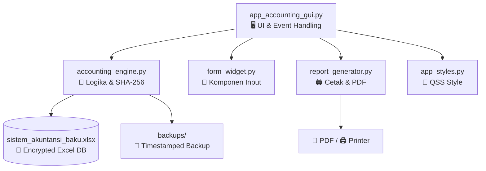

<div align="center">

<!-- ═══════════════ HEADER ANIMASI ═══════════════ -->


<!-- ═══════════════ BADGE UTAMA ═══════════════ -->


<!-- ═══════════════ BADGE REPO DINAMIS ═══════════════ -->


<!-- ═══════════════ TAGLINE ═══════════════ -->
### 🔐 Akuntansi Modern dengan Integritas *Blockchain-Grade*

Aplikasi pembukuan keuangan berbasis **Imutabel Ledger** yang dirancang untuk memenuhi standar
**transparansi**, **integritas**, dan **akuntabilitas** tingkat enterprise.
Setiap entri jurnal dikunci dengan **rantai kriptografi SHA-256** — layaknya teknologi *blockchain* —
untuk mendeteksi manipulasi data ilegal pada berkas database Excel.

<br/>

[📖 Dokumentasi](#-user-guide) · [🚀 Fitur](#-fitur-utama) · [🛠️ Build](#️-kompilasi-menjadi-exe) · [🐛 Laporkan Bug](https://github.com/duhemen/ba/issues)

</div>

---

## 📌 Daftar Isi

<details open>
<summary>Klik untuk melihat / menyembunyikan</summary>

- [✨ Fitur Utama](#-fitur-utama)
- [🏗️ Arsitektur Program](#️-arsitektur-program)
- [⚡ Instalasi Cepat](#-instalasi-cepat)
- [🛠️ Kompilasi Menjadi EXE](#️-kompilasi-menjadi-exe)
- [📖 User Guide](#-user-guide)
- [🔐 Simulasi Audit Keamanan](#-simulasi-audit-keamanan)
- [🧰 Tech Stack](#-tech-stack)
- [📄 Lisensi](#-lisensi)

</details>

---

## ✨ Fitur Utama

<table>
<tr>
<td width="50%" valign="top">

### 🔒 Keamanan & Integritas
- **Immutable Transaction Ledger** — Setiap baris jurnal dikunci dengan sidik jari kriptografi SHA-256 berantai
- **Blockchain Audit** — Verifikasi integritas database dari manipulasi eksternal
- **Auto-Backup Timestamp** — Backup otomatis ke folder `backups/` saat data valid
- **Security Alert** — Alarm otomatis jika rantai hash terputus

</td>
<td width="50%" valign="top">

### 📊 Analitik & Pelaporan
- **Dashboard Eksekutif** — Grafik batang Matplotlib Canvas + ringkasan saldo akun
- **Dua Sistem Jurnal** — Jurnal Umum kronologis + Jurnal Khusus (Kas, Pembelian, Pembayaran)
- **Laporan Laba Rugi Otomatis** — Pendapatan Usaha − Beban Operasional
- **Native Landscape Printing** — Cetak fisik via `QPrintDialog` + ekspor PDF murni

</td>
</tr>
<tr>
<td width="50%" valign="top">

### ⚙️ Konfigurasi Dinamis
- **Pengaturan Satker via UI** — Ubah nama instansi, sub-judul, ukuran font, dan logo tanpa sentuh kode
- **Upload Logo Lokal** — Dukungan berkas gambar kustom melalui antarmuka
- **Kop Kementerian Keuangan RI** — Format laporan resmi ber-logo

</td>
<td width="50%" valign="top">

### 🎨 User Experience
- **Pencarian Real-Time** — Live filtering tabel PyQt6 instan
- **QSS Corporate Style** — Tampilan korporat modern
- **Separation of Concerns** — Arsitektur modular anti-crash

</td>
</tr>
</table>

---

## 🏗️ Arsitektur Program

> Menerapkan prinsip **Separation of Concerns** — setiap modul punya tanggung jawab tunggal.



| Modul | Tanggung Jawab |
|---|---|
| `app_accounting_gui.py` | Manajemen visual antarmuka PyQt6, layout form, event-handling |
| `accounting_engine.py` | Logika matematika akuntansi, manipulasi Excel `openpyxl`, rantai SHA-256 |
| `report_generator.py` | Dokumen cetak HTML-CSS & interaksi printer fisik |
| `app_styles.py` | Gaya kosmetik korporat modern (QSS) |
| `form_widget.py` | Komponen input entri jurnal finansial |

---

## ⚡ Instalasi Cepat

```bash
# 1. Clone repositori
git clone https://github.com/duhemen/ba.git
cd ba

# 2. Buat virtual environment
python -m venv edge_ai_env
edge_ai_env\Scripts\activate    # Windows
# source edge_ai_env/bin/activate  # Linux/Mac

# 3. Install dependencies
pip install -r requirements.txt

# 4. Jalankan aplikasi
python app_accounting_gui.py
```

---

## 🛠️ Kompilasi Menjadi EXE

Ubah skrip Python menjadi **file eksekusi mandiri** tanpa ketergantungan Python interpreter di komputer target.

**1.** Buka PowerShell dan pastikan lingkungan virtual aktif:
```powershell
.\edge_ai_env\Scripts\Activate.ps1
```

**2.** Install PyInstaller:
```powershell
pip install pyinstaller
```

**3.** Eksekusi perintah kompilasi premium:
```powershell
pyinstaller --noconfirm --onedir --windowed `
  --add-data "app_styles.py;." `
  --add-data "form_widget.py;." `
  --add-data "accounting_engine.py;." `
  --add-data "report_generator.py;." `
  --add-data "logo_keu.png;." `
  --icon="edge_ai.ico" `
  --name "buku_akuntan" `
  app_accounting_gui.py
```

> 💡 **Tips:** Ganti `--onedir` menjadi `--onefile` untuk mengompresi menjadi satu file tunggal.

**4.** File executable final berada di:
```
dist/buku_akuntan/buku_akuntan.exe
```

---

## 📖 User Guide

<details>
<summary><b>1️⃣ Inisialisasi Awal & Entri Data</b></summary>

- Saat pertama dijalankan, sistem otomatis menerbitkan database `sistem_akuntansi_baku.xlsx`.
- Masuk ke menu **📝 Entri Transaksi Baru**.
- Isi: Tanggal → Nomor Bukti → Keterangan → Akun Rekiran (Ref) → Nominal Debit/Kredit.
- Klik **🔒 Posting Transaksi**.

</details>

<details>
<summary><b>2️⃣ Pencarian Real-Time & Live Filtering</b></summary>

- Buka tab **Buku Jurnal Umum** atau **Jurnal Khusus**.
- Ketik kata kunci (contoh: `Gaji`, `Komputer`, atau nominal).
- Tabel interaktif PyQt6 langsung menyembunyikan baris yang tidak sesuai secara instan.

</details>

<details>
<summary><b>3️⃣ Mengubah Profil Satker</b></summary>

- Masuk ke menu **⚙️ Pengaturan Satker**.
- Ubah Nama Instansi → `Buku Pencatatan Akuntansi (sesuai unor/upt/perusahaan)`.
- Ubah sub-judul → `MANIFES LAPORAN KEUANGAN (sesuai unor/upt/perusahaan)`.
- Klik **Cari File** untuk upload `logo_keu.png` kustom.
- Sesuaikan ukuran font, lalu klik **💾 Simpan Perubahan Pengaturan**.

</details>

<details>
<summary><b>4️⃣ Ekspor Dokumen & Cetak Fisik</b></summary>

- Pada tab laporan finansial, tekan **📕 Ekspor PDF** → arsip `.pdf` lanskap rapi.
- Tekan **🖨️ Cetak** → jendela printer Windows terbuka → pilih printer *Ready* → Print.

</details>

<details>
<summary><b>5️⃣ Audit Keamanan & Simulasi Manipulasi</b></summary>

- Tekan tombol **🛡️ Audit Rekonsiliasi** di sidebar kiri.
- ✅ Jika aman → pop-up hijau + backup cadangan otomatis diterbitkan.
- ⚠️ **Uji Manipulasi:**
  1. Tutup aplikasi.
  2. Buka `.xlsx` lewat MS Excel, ubah satu angka nominal secara ilegal, simpan.
  3. Buka kembali aplikasi → klik audit.
  4. 🚨 **Security Alert** muncul — sistem menolak memproses laporan karena rantai hash terputus!

</details>

---

## 🔐 Simulasi Audit Keamanan

```text
┌─────────────────────────────────────────────────────────────┐
│  VERIFIKASI RANTAI KRIPTOGRAFI                              │
├─────────────────────────────────────────────────────────────┤
│  Blok #001  hash: a3f9...c21e  ✅ VALID                     │
│  Blok #002  hash: 7b2d...e94f  ✅ VALID                     │
│  Blok #003  hash: c81a...0b3d  ✅ VALID                     │
│  Blok #004  hash: 5e6f...9a72  ❌ HASH MISMATCH!            │
├─────────────────────────────────────────────────────────────┤
│  🚨 SECURITY ALERT — Manipulasi data terdeteksi pada Blok 4 │
│  Proses pelaporan dibatalkan. Hubungi administrator.        │
└─────────────────────────────────────────────────────────────┘
```

---

## 🧰 Tech Stack

<div align="center">

| Komponen | Teknologi |
|:---:|:---:|
| **Bahasa** |  |
| **GUI Framework** |  |
| **Excel Engine** |  |
| **Visualisasi** |  |
| **Kriptografi** |  |
| **Packaging** |  |

</div>

---

## 📄 Lisensi

Proyek ini dilisensikan di bawah **MIT License** — lihat berkas [LICENSE](LICENSE) untuk detail.

---

<div align="center">

### 🌟 Jika proyek ini bermanfaat, berikan bintang!

[](https://github.com/duhemen/ba/stargazers)
[](https://github.com/duhemen/ba/network/members)

<br/>


**Dibuat dengan ❤️ untuk transparansi keuangan Indonesia**

</div>

---
